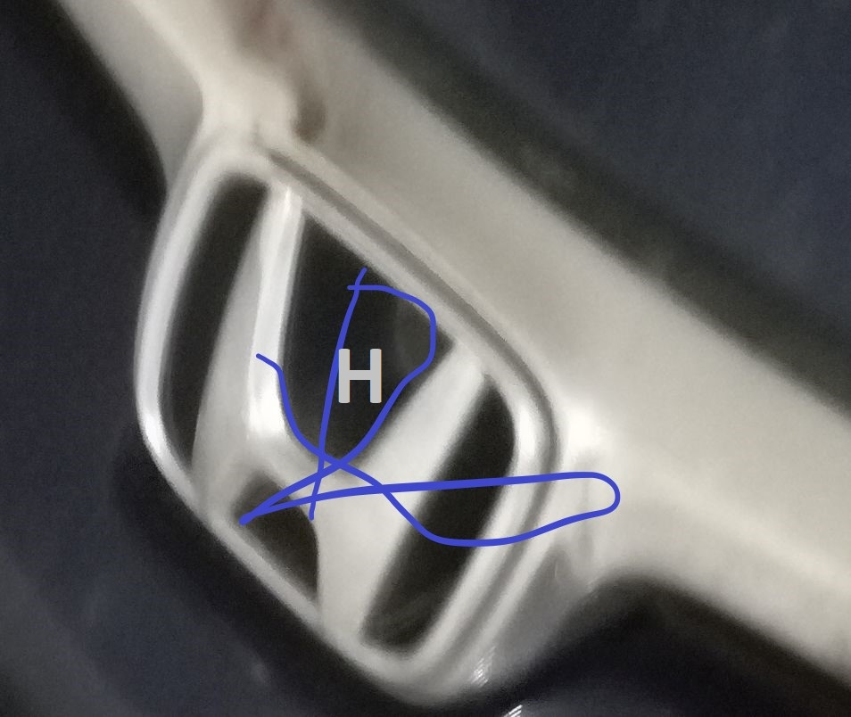

# CarCompany Predictor

Predict company name from a given car logo.

## Description

This project was written in python using [ImageAi](https://github.com/OlafenwaMoses/ImageAI) library. 
The model was trained
with 6143 image divided among 13 different car company. The dataset was handpicked from loosely 
scraped websites and contains images, photos, drawings, sketches at various color schemes 
(black/white, RGB etc), different angles and sometimes with other images
as background.

The model classifies a given image by attributing a predicted brand name: 

\
**True Company:** Toyota 
**Predicted Company:** Toyota

\
**True Company:** Honda 
**Predicted Company:** Honda

\
**True Company:** Mercedes 
**Predicted Company:** Suzuki

## Model Metrics

The model had an accuracy of 92.5676%.

## Features

The model was created using [Custom Image Prediction](https://github.com/OlafenwaMoses/ImageAI/blob/master/imageai/Prediction/CUSTOMPREDICTION.md)
class of ImageAI. 

###### Train
Python "train.py" file was used to train the dataset.
Link for dataset is given below. Dataset is divided into two directories train
and test. Each carry 13 company(classes). After training, three additional directories produce logs,models,jsons. **Models**
directories contain all the model files. Above file was run on google colab.

###### Test

Python "test.py" file was used to test the models. Here the model with highest accuracy was used. Output of this file shows
the predicted class(company) of a given logo. Directory **test_image** contains the images to be classified. 

## Links

Links for precompiled dataset,models,jsons and ImageAi documentation is given below:
- Dataset,Models and Jsons - [Link](https://drive.google.com/open?id=1nSGtjHNpIrn0CmFtvl8gLoULUBA1Di20) 
- Documentation - [Link](https://imageai.readthedocs.io/en/latest/)

## Requirement

All the requirements for this to run is given in documentation link.

